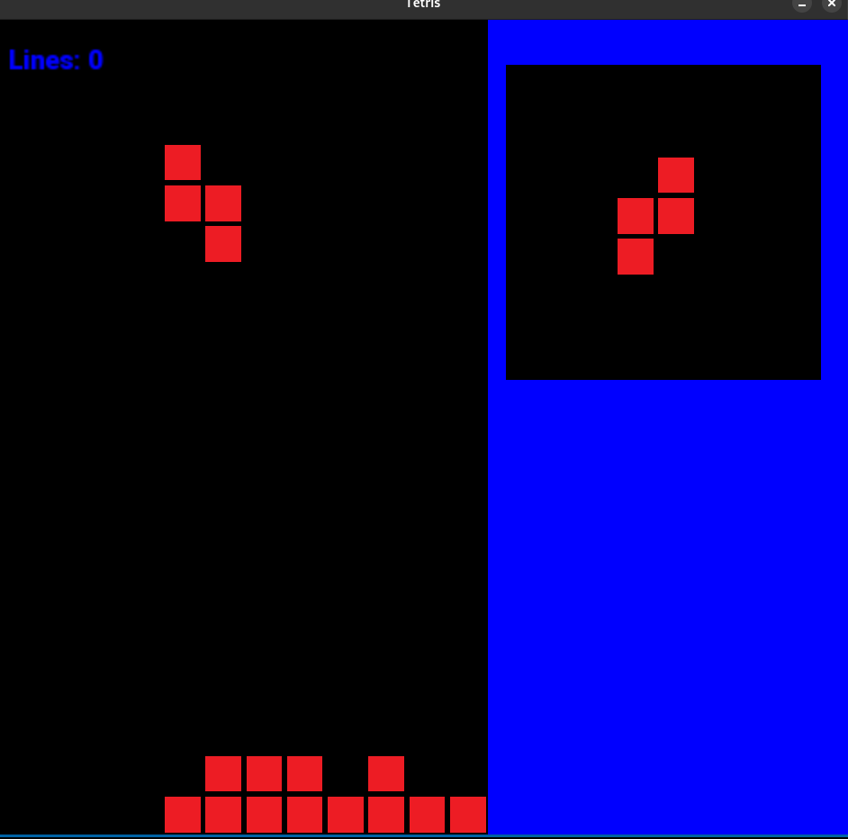

# Tetris-Game-SFML

I will be making a tetris game using the graphics library SFML (Simple and Fast Media Layer). This was made as a Semester Project.

### Note:
I used code from another git repository and modified it. The repository I cloned was: https://github.com/ThomasGITH/Tetris-SFML

### Modifications:
1. Added a section which shows the next piece that will come.
2. Improved rotation of blocks.
3. Added a Game Over fucntionality instead of the game just closing.
4. Changed Forwa font to Roboto.

### Game Preview:

